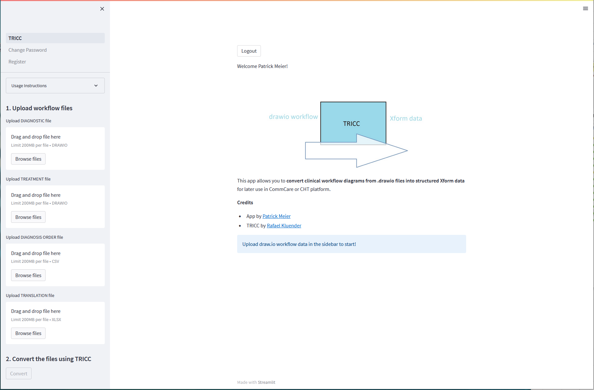

# tricc_webapp
Web application to convert drawio workflow diagrams into XForm data using TRICC.

### Software
- Streamlit
- Python
- Docker
- TRICC

**Credits**
- App by [Patrick Meier](https://www.swisstph.ch/en/people-teaser-detail/teaser-detail/patrick-meier#pageRecord)
- TRICC by [Rafael Kluender](https://www.swisstph.ch/en/people-teaser-detail/teaser-detail/rafael-kluender#pageRecord)
